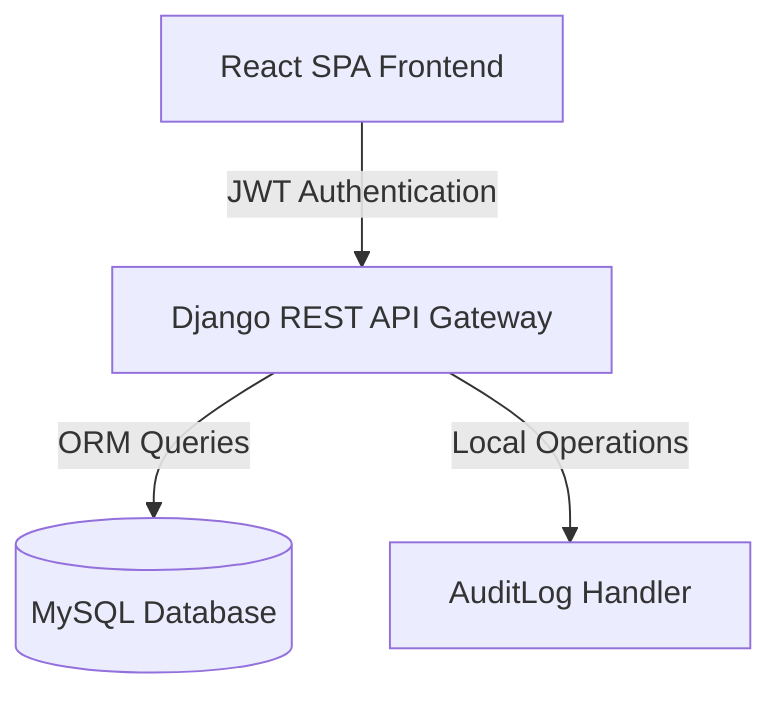

# Campus Resource Management System (CampusRMS)

CampusRMS is a full-stack, enterprise-grade Campus Resource Management System built to facilitate, monitor, and audit physical resource scheduling (laboratories, classrooms, conference halls, computer stations). It features role-based access control, transaction-safe scheduling validation, interactive floor plan navigation, and audit logs.

---

## 🏛️ System Architecture



---

## 💻 Tech Stack Specification

### Backend (REST API)
*   **Framework**: Django 5.x & Django REST Framework (DRF) 3.15.x
*   **Database Integration**: MySQL (Production Connection via `mysqlclient`) / SQLite (Fallback)
*   **Authentication**: JSON Web Tokens (SimpleJWT: `rest_framework_simplejwt`)
*   **CORS Management**: `django-cors-headers`

### Frontend (Single Page Application)
*   **Core Libraries**: React 18.x, Vite 6.x
*   **Styling**: Vanilla CSS with Tailwind CSS configurations, glassmorphic UI patterns
*   **Animation**: Framer Motion
*   **Icons**: Lucide React
*   **HTTP Client**: Axios (configured with interceptors to inject simpleJWT headers)

---

## 🗄️ Database Schemas (Model Details)

### 1. `User` Model
Exposes user credentials and system permission flags.
*   `email` (EmailField, Unique, Primary Key)
*   `name` (CharField)
*   `phone` (CharField, Unique)
*   `role` (CharField: `Student`, `Staff`, `Admin`)
*   `status` (CharField: `ACTIVE`, `INACTIVE`)
*   `created_at` (DateTimeField)

### 2. `Resource` Model
Represents reservation assets.
*   `resource_name` (CharField)
*   `resource_type` (CharField: `Lab`, `Classroom`, `Event Hall`, `Computer`)
*   `description` (TextField, Nullable)
*   `capacity` (PositiveIntegerField)
*   `location` (CharField) - Physical room and block directions
*   `amenities` (TextField) - Comma-separated list of hardware/features (e.g. `Projector, VR Headset`)
*   `availability_status` (BooleanField) - Maintenance flag
*   `created_at` (DateTimeField)

### 3. `Booking` Model
Represents scheduling allocations.
*   `user` (ForeignKey -> `User`)
*   `resource` (ForeignKey -> `Resource`)
*   `booking_date` (DateField)
*   `time_slot` (CharField, e.g. `"09:00 AM - 11:00 AM"`)
*   `purpose` (TextField)
*   `status` (CharField: `Pending`, `Approved`, `Rejected`)
*   `checked_in` (BooleanField) - Physical presence flag
*   `check_in_time` (DateTimeField, Nullable)
*   `created_at` (DateTimeField)

### 4. `AuditLog` Model
Captures system actions for compliance.
*   `user` (ForeignKey -> `User`, Nullable)
*   `action` (CharField, e.g. `"LOGIN_SUCCESS"`, `"BOOKING_CREATE"`)
*   `timestamp` (DateTimeField)
*   `ip_address` (GenericIPAddressField)

### 5. `Notification` Model
Feeds the live user alerts queue.
*   `user` (ForeignKey -> `User`)
*   `message` (TextField)
*   `is_read` (BooleanField)
*   `created_at` (DateTimeField)

---

## 📡 API Endpoints Directory

### Authentication
*   `POST /api/token/` - Obtain JWT access/refresh token pair
*   `POST /api/token/refresh/` - Refresh expired access token
*   `POST /api/register/` - Create a new user profile
*   `GET /api/user/` - Fetch profile metadata for authenticated session

### Resources Directory
*   `GET /api/resources/` - Query list of resources (supports `search` and `type` filters)
*   `POST /api/resources/` - Create resource (Admin/Staff only)
*   `PUT /api/resources/<id>/` - Update resource (Admin/Staff only)
*   `DELETE /api/resources/<id>/` - Remove resource & cascade delete associated bookings

### Bookings Workflow
*   `GET /api/bookings/` - Retrieve bookings (Supports timeframe filters: `all`, `upcoming`, `past`)
*   `POST /api/bookings/` - Create a booking (Includes optional `recurring_type` payload)
*   `PUT /api/bookings/<id>/` - Update a pending booking
*   `DELETE /api/bookings/<id>/` - Cancel a booking
*   `POST /api/bookings/<id>/approve/` - Approve pending booking (Admin only)
*   `POST /api/bookings/<id>/reject/` - Reject pending booking (Admin only)
*   `POST /api/bookings/<id>/check_in/` - Trigger QR physical check-in status update

### Dashboard Stats
*   `GET /api/admin/stats/` - Retrieve metrics summary, live occupancy status, and booking density chart arrays

---

## ⚙️ Core Workflows & Implementation Logic

### 1. Recurring Booking Creation Loop
When creating a recurring schedule, the client provides a `recurring_type` (`daily` or `weekly`). The backend processes this inside a database transaction:
```python
# Pseudo-implementation logic in views.py
booking_dates = []
if recurring_type == 'daily':
    booking_dates = [base_date, base_date + 1 day, base_date + 2 days]
elif recurring_type == 'weekly':
    booking_dates = [base_date, base_date + 1 week, base_date + 2 weeks]

with transaction.atomic():
    for date in booking_dates:
        # 1. Assert resource availability status
        # 2. Check for overlapping Approved bookings in the same time_slot
        # 3. Create independent Booking records
```

### 2. Simulated QR check-in
Access passes feature printable barcodes. The student scans the barcode at the resource (simulated via **Simulate QR Check-In** on the UI pass modal):
1. Client makes `POST /api/bookings/<id>/check_in/`.
2. Backend validates:
   - Requesting user owns the booking.
   - The booking's `status == "Approved"`.
   - Today's date matches the `booking_date`.
3. If valid, `checked_in` changes to `True`, `check_in_time` is set to the current timestamp, and the action is logged in `AuditLog` alongside the client's IP.

### 3. Utilization Exporter (CSV Reports)
Admin dashboard features a button to export CSV files. The browser formats stats, usage density, and room statuses into a multi-table CSV format:
```javascript
// Local client CSV creation
let csvContent = "data:text/csv;charset=utf-8,";
csvContent += "SYSTEM SUMMARY REPORT\nMetric,Value\n...";
csvContent += "\nRESOURCE UTILIZATION DENSITY\nResource Name,Total Bookings\n...";
const encodedUri = encodeURI(csvContent);
// Triggers local system browser download
```

---

## ⚙️ How to Deploy & Run

### Setup Environment Variables
Configure your database connectivity in `CampusRMS/backend/config/settings.py`'s `DATABASES` section to point to your MySQL server.

### Run Backend
```bash
cd CampusRMS/backend
python -m venv venv
.\venv\Scripts\activate
pip install -r requirements.txt
python manage.py makemigrations api
python manage.py migrate
python manage.py runserver
```

### Run Frontend
```bash
cd CampusRMS/frontend
npm install
npm run dev
```
